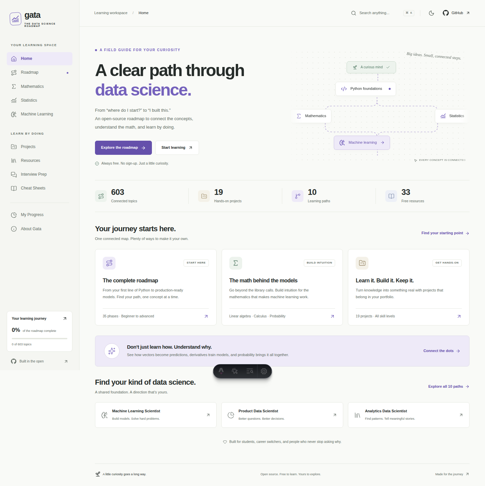

# Gata Science Roadmap

**A clear path through data science.** An open-source, project-first learning platform that connects programming, mathematics, statistics, machine learning, and production practice.



**Local demo:** run `npm run dev`, then open [localhost:4321](http://localhost:4321). **Repository:** [Are1V/Gata-Science-Roadmap](https://github.com/Are1V/Gata-Science-Roadmap). The live site is available at [are1v.github.io/Gata-Science-Roadmap](https://are1v.github.io/Gata-Science-Roadmap/) once the Pages workflow completes.

## What you can do

- Explore a complete 35-phase curriculum with 603 uniquely addressable concepts.
- Pan and zoom an expandable React Flow roadmap, or use its keyboard-friendly list view.
- Follow mathematical prerequisite graphs for regression, PCA, K-Means, and neural networks.
- Read 19 detailed guides with equations, numerical examples, code, pitfalls, interview prompts, and exercises.
- Try interactive vector, gradient-descent, and sigmoid demonstrations.
- Choose among 10 specialization paths and filter the map by level.
- Build from 19 project briefs with open datasets, evaluation criteria, and suggested repository structures.
- Search topics, projects, 33 resources, 30 interview questions, and 12 cheat sheets.
- Save topic and project completion locally; inspect chapter progress, export a record, or explicitly reset it.
- Use light and dark themes on desktop, tablet, and mobile.

No account, database, analytics, paid API, or backend is required. External resources have their own terms; the M5 dataset requires a free Kaggle account.

## Content scope

The **curriculum structure** covers every phase from getting started through specialization: Python, CS, Git, algebra, calculus, probability, statistics, data manipulation, SQL, cleaning, EDA, ML foundations, regression, classification, trees, evaluation, validation, feature engineering and selection, optimization, unsupervised learning, forecasting, deep learning, NLP, vision, recommenders, explainability, experimentation, causal inference, engineering, production, MLOps, and responsible practice.

The V1 distinguishes **curriculum entries** from **authored detailed guides**. Every chapter has an original overview, intuition, prerequisites, a practice task, a pitfall, and curated sources. A book icon identifies entries with a deep guide. The other entries link to chapter resources; they are not presented as fully authored individual tutorials. The collection and schemas support adding those lessons without changing the UI.

Estimates on lessons describe approximate study time including exercises, not measured video durations. Completing a concept is a personal learning record, not a certification.

## Stack and architecture

Astro statically renders every route. React islands provide the roadmap, search, filters, progress, theme controls, and mathematical labs. TypeScript, Tailwind CSS, Lucide, XYFlow, KaTeX, and Markdown/MDX support the implementation.

```text
src/
  content/guides/       Markdown lessons, validated by Astro collections
  content/projects/    Structured project briefs
  content/resources/   Curated official and educational resources
  content/interviews/  Categorized questions and explanations
  content/cheatsheets/ Concise reference material
  data/curriculum.json Complete curriculum, topic IDs, chapter dependencies
  data/roadmap.ts       Shared indexes, guide mappings, specializations
  components/          React islands and reusable Astro components
  hooks/useProgress.ts Versioned local-storage store and cross-tab subscription
  layouts/             Accessible shared shell
  pages/               Static routes, generated chapter and guide pages
  styles/              Design tokens, responsive layout, dark theme
  utils/urls.ts        Base-aware internal URLs and repository URL
scripts/               Static-link and external-resource checks
tests/                 Content-integrity and browser tests
.github/               Deployment workflow and contribution templates
```

The mathematical connection graph is generated from lesson frontmatter. Chapter graph edges come from chapter prerequisites. Search uses a local index and sends no search queries to a service.

## Run locally

Use Node.js **22.12 or newer** (the workflow uses Node 22) and npm.

```bash
npm ci
npm run dev
```

```bash
npm run lint
npm run check
npm test
npm run build
npm run check:links
npx playwright install chromium
npm run test:e2e
npm run preview
```

Playwright starts a preview server for the previously built `dist/` directory. Build before testing. On Linux CI, use `npx playwright install --with-deps chromium` to install system dependencies as well.

`npm run check:resources` verifies resource and dataset URLs and writes `reports/resource-links.json`. Some providers may rate-limit automated clients; inspect failures rather than automatically deleting a resource. This network check is kept separate from deterministic CI checks.

Format changes with `npx prettier --write src scripts tests`. Linting covers TypeScript and JavaScript; Astro files are checked by `astro check`. Automated accessibility checks supplement, rather than replace, keyboard and visual review.

## Deploy free on GitHub Pages

1. Create a GitHub repository and push this project to its `main` branch.
2. In **Settings → Pages → Build and deployment**, choose **GitHub Actions**.
3. Run or allow the **Verify and deploy to GitHub Pages** workflow.
4. Open the URL shown by the deployment job.

The workflow derives `SITE_URL`, `BASE_PATH`, and `PUBLIC_REPOSITORY_URL` from the repository. A repository named `OWNER.github.io` uses `/`; other repositories use `/<repository>/`. GitHub Pages uses case-sensitive paths. The workflow checks the configured base path and runs browser tests before publishing. Pull requests run the build and tests without deploying.

All internal links and public assets use the shared base helper. Every page has a generated `index.html`; direct links and refreshes work without SPA rewrites. A custom `404.html` is included. GitHub Pages itself supplies HTTPS.

For a local subpath test:

```bash
BASE_PATH=/Gata-Science-Roadmap/ SITE_URL=https://are1v.github.io npm run build
BASE_PATH=/Gata-Science-Roadmap/ npm run check:links
BASE_PATH=/Gata-Science-Roadmap/ npm run test:e2e
```

Stop any preview server built for a different base before running that test. Astro may background development servers in agent environments; `npx astro preview stop` and `npx astro dev stop` stop them. For a foreground server, use `--ignore-lock`.

For a custom domain, set `SITE_URL` to your origin and `BASE_PATH=/` in the workflow and configure GitHub Pages DNS settings. `PUBLIC_REPOSITORY_URL` supplies all GitHub links; without it, links point to the local About page explaining the unpublished edition, not an invented repository.

## Progress and privacy

`gata.progress.v1` stores completed concept and project IDs. `gata.theme` stores the chosen theme. Progress synchronizes between open tabs in the same browser origin. Different browsers and devices do not synchronize. Clearing browser storage removes progress. JSON export is a personal backup record; importing a backup is not included in V1.

Malformed stored JSON is handled safely. Storage write failures show a message rather than reporting success. No third-party fonts, analytics scripts, or tracking pixels are loaded.

## Contribute

See [CONTRIBUTING.md](CONTRIBUTING.md) for topic, resource, project, graph, and content-correction instructions. Please follow the [Code of Conduct](CODE_OF_CONDUCT.md).

Content should be accurate, concrete, appropriately scoped, and independently understandable. Prefer official documentation, university material, and open textbooks. Do not copy proprietary course text or provide complete project solutions by default.

## License and acknowledgements

[MIT](LICENSE). Code and original educational material in this repository are covered by this license. Linked resources and datasets retain their own licenses; check them before redistributing data.

Inspired by the interaction model of [roadmap.sh](https://roadmap.sh/), with original implementation, design, and lesson text. Thanks to the Astro, React, React Flow, NumPy, Pandas, scikit-learn, PyTorch, KaTeX, Tailwind CSS, and Lucide communities, and the educators behind the linked free material.
